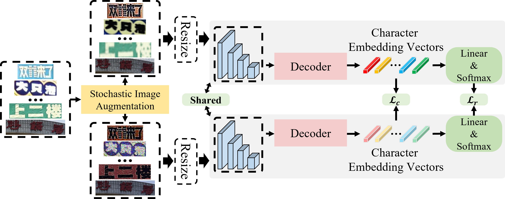

# Character Aware Alignment Contrastive Learning for Chinese Scene Text Recognition

Official PyTorch implementation for Character Aware Alignment Contrastive Learning for Chinese Scene Text Recognition (CAAC).

## Abstract
Indistinguishably caused by enormous character categories and significant character similarity is main challenge for Chinese scene text recognition. In this paper, we explore the topic of discriminative Chinese character representations extraction to cope with the above difficulties. The **C**haracter **A**ware **A**lignment **C**ontrastive learning (CAAC) is proposed for Chinese scene text recognition, which achieves superior performance in an overall concise framework. We leverage the character aware properties of attentional decoder to instantiate character level contrastive learning with more fine-grained atomic elements than previous sub-word level self-supervised contrastive learning based text recognition methods. In addition, the projection-free strategy for directly coupling task loss and supervised contrastive loss is investigated to jointly guide the recognizer to be flexible to Chinese character identification and tradeoff between intra- and inter-domain generalization. All the proposed strategies are plug-and-play, we demonstrate that the CAAC induces stable performance boosting to existing methods and projection-free brings superior cross-domain generalization than three projection heads. Extensive experiments have been conducted on multiple text recognition benchmarks including a self-collected ship license plate dataset to verify the recognition performance, generalization capability and transferability. The experimental results show that our method outperforms previous methods by 2.81% and 1.34% on Chinese ***Scene*** and ***Web*** text recognition datasets.



## Runtime Environment

- Inference requires PyTorch >= 1.7.1
- For training and evaluation, install the dependencies
```
pip install -r requirements.txt
```

## Datasets

- Download ***[Scene](https://github.com/FudanVI/benchmarking-chinese-text-recognition)*** and ***[Web](https://github.com/FudanVI/benchmarking-chinese-text-recognition)*** lmdb dataset for training and evaluation.
- For cross-domain generalization analysis, the commonly used English datasets can be downloaded in [IIIT5K](http://cvit.iiit.ac.in/projects/SceneTextUnderstanding/IIIT5K.html) (IIIT), [Street View Text](http://www.iapr-tc11.org/mediawiki/index.php/The_Street_View_Text_Dataset) (SVT), [ICDAR 2015](https://rrc.cvc.uab.es/?ch=4) (IC15 1811), [Street View Text Perspective](https://mmocr.readthedocs.io/en/v0.6.1/datasets/recog.html#svtp) (SVTP), and [WordArt](https://github.com/xdxie/WordArt).
- The new collected SLPR and SLPR-P dataset consists of 6,922 artistic text images with 5,131 training images and 1,791 testing images. The dataset is available at [Project]().

## Training and Evaluation

- Training

```
python main.py --config=configs/xxx.yaml
```

- Evaluation

```
python main.py --config=configs/xxx.yaml --phase test --image_only
```

## Pretrained Models

Get the pretrained models from [GoogleDrive](https://drive.google.com/drive/folders/1WkxqNpBMjTUAW5M1E6OdkXw_PDFfAy6Y?usp=sharing). Performances of some pretrained models are summaried as follows, ACC / NED follow the percentage format and decimal format, respectively.

 **Model**         | **Scene**     | **Web**       | **log (Scene)** | **log (Web)** | **SLPR**      | **SLPR-P**    | **log (SLPR)** | **log (SLPR-P)** 
:-----------------:|:-------------:|:-------------:|:---------------:|:-------------:|:-------------:|:-------------:|:--------------:|:----------------:
 ResNet-45-CAAC    | 65.11 / 0.815 | 63.40 / 0.801 | [Link](./logs/training/ResNet-45-Scene-CAAC.txt)     | [Link](./logs/training/ResNet-45-Web-CAAC.txt)              | 92.85 / 0.977 | 86.60 / 0.945 | [Link](./logs/training/ResNet-45-SLPR-CAAC.txt)               | [Link](./logs/training/ResNet-45-SLPR-P-CAAC.txt)                 
 ResNet-45-no-CAAC | 64.07 / 0.809 | 62.86 / 0.799 | [Link](./logs/training/ResNet-45-Scene-no-CAAC.txt)  | [Link](./logs/training/ResNet-45-Web-no-CAAC.txt)              | 92.85 / 0.976 | 88.50 / 0.954 | [Link](./logs/training/ResNet-45-SLPR-P-no-CAAC.txt)               | [Link](./logs/training/ResNet-45-SLPR-P-no-CAAC.txt)                 
 Swin-S-CAAC       | 74.91 / 0.88. | 64.74 / 0.813 | [Link](./logs/training/Swin-S-Scene-CAAC.txt)        | [Link](./logs/training/Swin-S-Web-CAAC.txt)              |       -       |       -       |       -        |      -            
 Swin-S-no-CAAC    | 72.93 / 0.873 | 62.64 / 0.800 | [Link](./logs/training/Swin-S-Scene-no-CAAC.txt)     | [Link](./logs/training/Swin-S-Web-no-CAAC.txt)              |       -       |       -       |     -          |    -              


## Evaluation logs

Please click the hyperlinks to see the detailed experimental results, following the format of  (*[gt]* *[pt]*)

- ResNet-45-Scene-CAAC: [Link](./logs/evaluation/ResNet-45-Scene-CAAC.txt) 
- Swin-S-Scene-CAAC: [Link](./logs/evaluation/Swin-S-Scene-CAAC.txt)
- ResNet-45-Web-CAAC: [Link](./logs/evaluation/ResNet-45-Web-CAAC.txt)
- Swin-S-Web-CAAC: [Link](./logs/evaluation/Swin-S-Web-CAAC.txt)

## Acknowledgements

This implementation is based on the repository [ABINet](https://github.com/FangShancheng/ABINet), [SupContrast](https://github.com/HobbitLong/SupContrast), [FudanVI
/benchmarking-chinese-text-recognition](https://github.com/FudanVI/benchmarking-chinese-text-recognition), [WordArt](https://github.com/xdxie/WordArt).

## License
Follow the [ABINet](https://github.com/FangShancheng/ABINet), this project is only free for academic research purposes, licensed under the 2-clause BSD License - see the LICENSE file for details.
